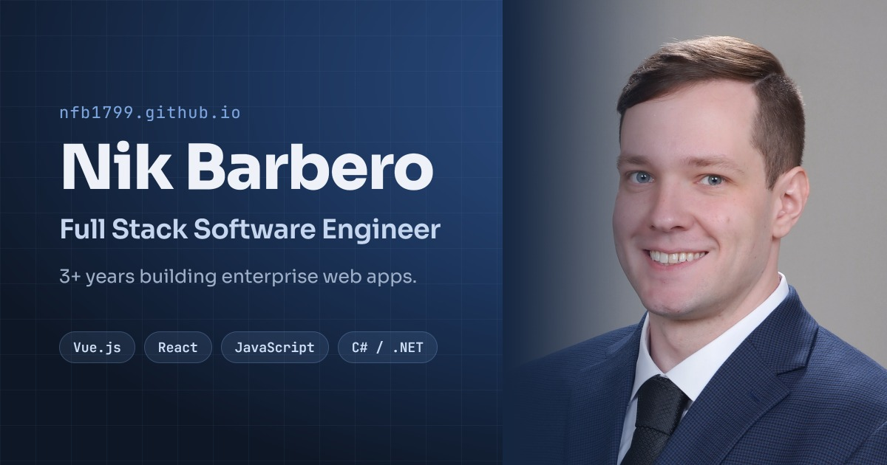

# nfb1799.github.io

Personal portfolio of **Nik Barbero** — Full Stack Software Engineer.

**Live site: [nfb1799.github.io](https://nfb1799.github.io/)**

[](https://nfb1799.github.io/)

## About

A single-page portfolio showcasing my experience, core skills, and featured projects — enterprise web work in Vue.js and C#/.NET, plus personal full-stack projects in React and Firebase.

## Tech Stack

- **React 19** + **TypeScript**
- **Vite** for dev/build tooling
- **Tailwind CSS** with a Material-inspired design token system
- Deployed to **GitHub Pages** via `gh-pages`

## Running Locally

```bash
npm install
npm run dev
```

Other scripts:

| Command | Description |
| --- | --- |
| `npm run build` | Type-check and build for production |
| `npm run preview` | Preview the production build locally |
| `npm run lint` | Run ESLint |
| `npm run deploy` | Build output → `gh-pages` branch |

## Contact

- **Email:** [nikbarbero@yahoo.com](mailto:nikbarbero@yahoo.com)
- **LinkedIn:** [linkedin.com/in/nik-barbero](https://www.linkedin.com/in/nik-barbero/)
- **GitHub:** [@nfb1799](https://github.com/nfb1799)
